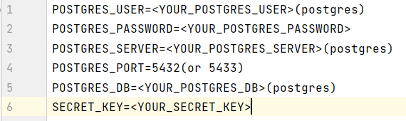
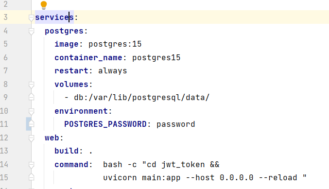
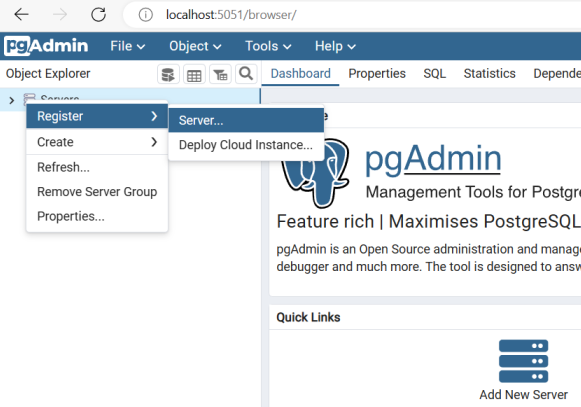
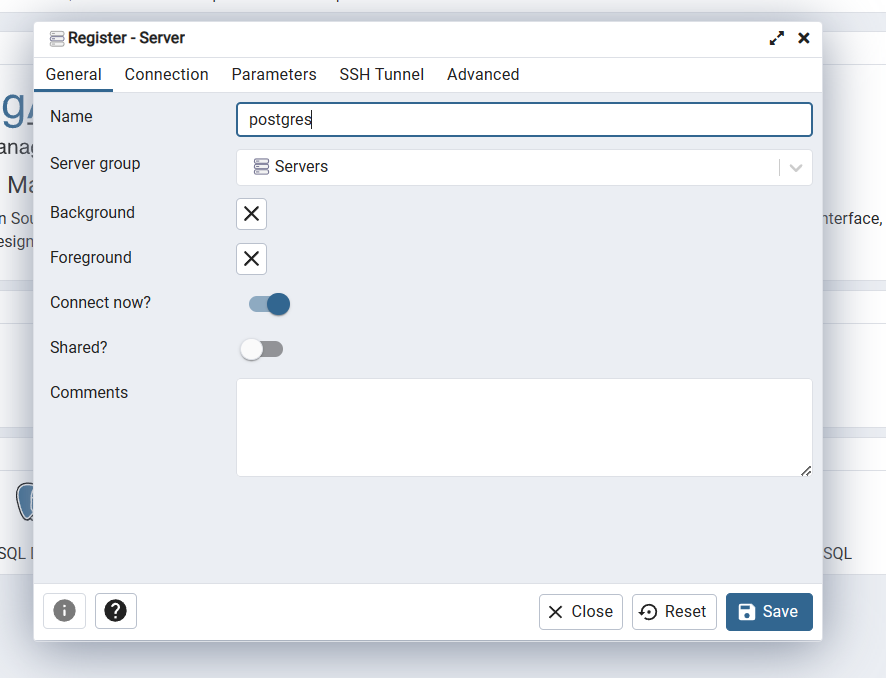
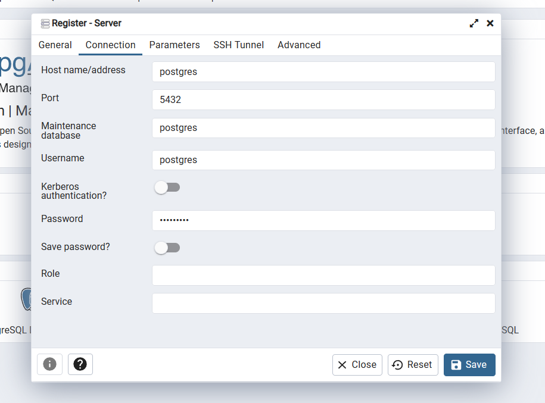
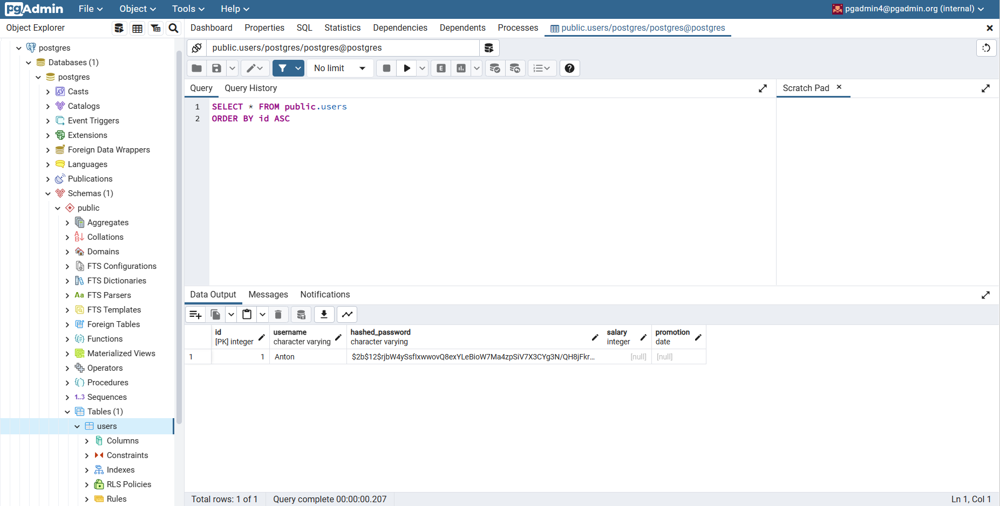
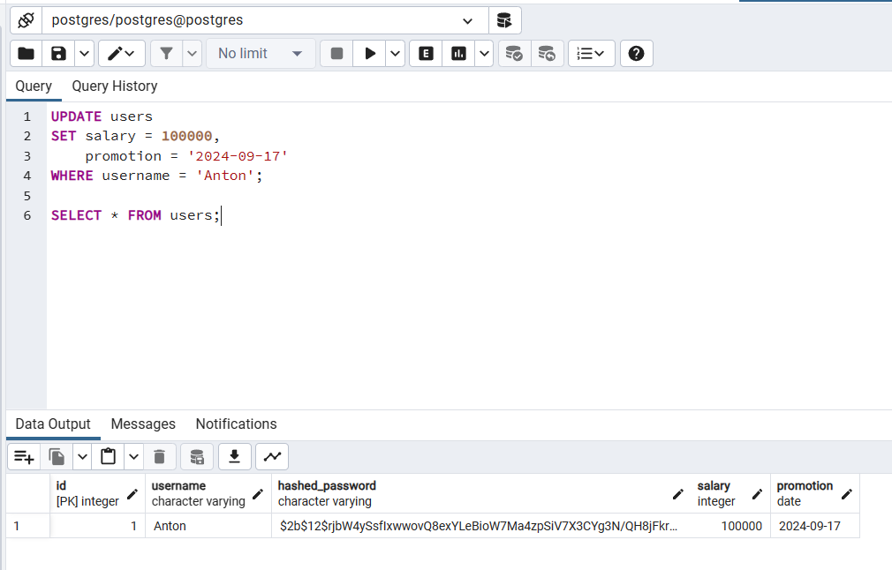

# REST service for viewing user data using a JWT token

## Description
>Implemented a REST service for viewing the current salary and the date of the next
increase.  Each
employee can only see their own amount.  A method has been implemented where a secret token is issued by the employee's login and password
, which is valid for a certain time. The request
for salary data is issued only upon presentation of a valid token.

## Stack

>Language: __Python 3__<br>
Web framework: __FastAPI__<br>
Database: __PostgreSQL__<br>

Optional requirements:<br>
- Docker Desktop<br>
- SQLAlchemy

## urls

> - <p>/token — get a token;<br>
> - <p>/users/me/ — viewing user data;<br>
> - <p>/users/ — creating a user;<br>
> - <p>/docs/ — documentation;<br>

## Private information

>Hidden information in the file .env:<br>
>
> You can generate a SECRET KEY yourself or you can generate it from a site like <a href=https://www.grc.com/passwords.htm>this</a>.

## Launch

1. Clone the repository and go to the project directory, activate the virtual environment:
```
git clone https://github.com/anton431/jwt_token_FastAPI.git
```
2. Install all the necessary dependencies and fill in the file .env:
```
pip install -r requirements.txt
```
3. Set the password for your database in docker-compose in the POSTGRES_PASSWORD variable:
>
4. Run the commands:
```
docker-compose build
```
```
docker-compose up
```
5. The project uses PostgreSQL, login to <a target="_blank" href=http://localhost:5051/login>pgAdmin</a> using email and password:
```
pgadmin4@pgadmin.org
```
```
root
```
6. Register the server: <br>
>
>
> 
> 

7. You can set the salary and the date of the increase to users:

8. You can make <a href=http://127.0.0.1:8000/docs>requests</a>.